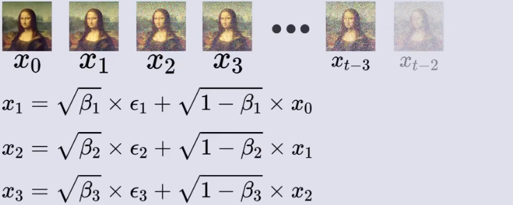
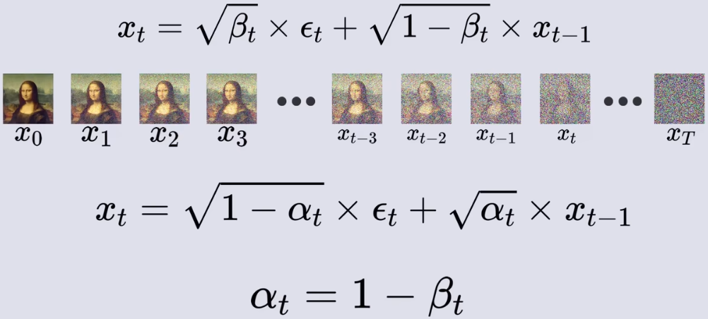
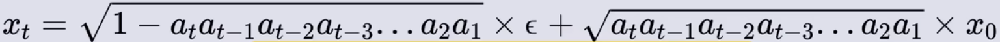
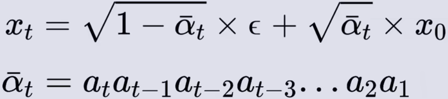
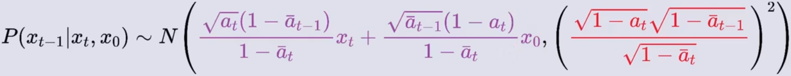
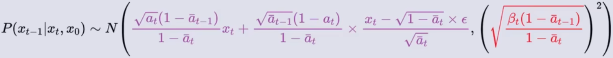

## 环境搭建
`conda create -n dp python=3.11`  
main packge: `torch`

## 示例数据集
`unzip data.zip` 

-----------------

## 变量定义
图片加噪过程及变量`x, beta`的定义，`beta`从零到一递增，一般不会增到1，大概0.02左右合适

变量`alpha`的定义，时间步定义为`T-1`，即全部加噪加噪过程步数

从原图推理到第`t`时间步的公式

变量`alpha_bar`定义为从该位置往前的所有`alpha`相乘

从当前图片`x_t`推理前一步图片`x_t_minus_1`的公式

使用推理出的图片替换上图中的`x_0`

----------------

